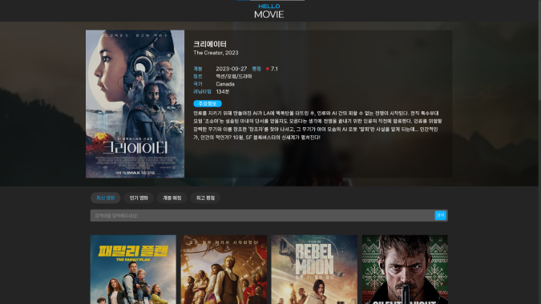

# Vue.js TMDB API를 이용한 영화정보 사이트

Vue.js와 TMDB API를 활용한 영화 정보 제공 사이트입니다. 사용자들은 최신 영화, 인기 영화, 개봉 예정 영화, 최고 평점 영화 등 다양한 카테고리의 영화 정보를 탐색하고, 영화 검색 기능을 통해 원하는 영화를 찾을 수 있습니다.

<div align="center">
<a href="https://movie-project-ecru.vercel.app/"></a>
</div>
## 프로젝트 목표

- Vue.js 프레임워크를 이용한 SPA(Single Page Application) 개발
- TMDB API를 사용하여 실시간 영화 데이터 연동
- 사용자 친화적인 UI/UX 디자인 구현

## 기술 스택

- **프론트엔드**: Vue.js
- **스타일링**: SCSS
- **API**: TMDB API
- **라우팅**: Vue Router
- **HTTP 클라이언트**: Axios

## 프로젝트 구조

- `src/assets`: 스타일 시트 및 이미지 파일
- `src/components`: Vue 컴포넌트
- `src/views`: 페이지 뷰
- `src/router`: Vue Router 설정
- `src/App.vue`: 메인 애플리케이션 컴포넌트
- `src/main.js`: 애플리케이션 시작점

## 구현 기능

- **영화 카테고리별 조회**: 최신 영화, 인기 영화, 개봉 예정 영화, 최고 평점 영화 등 카테고리별 영화 목록 제공
- **영화 상세 정보**: 선택한 영화의 상세 정보 및 출연진 정보 제공
- **영화 검색**: 키워드를 통한 영화 검색 기능
- **반응형 웹 디자인**: 모바일 및 태블릿을 포함한 다양한 디바이스 지원

## 라이브러리 설치

```bash
npm install sass
npm install axios
npm install vue-router
```

- `npm install sass`:
  Sass(Syntactically Awesome Style Sheets)  
  Sass는 CSS의 확장으로, 변수, 중첩, 함수, 그리고 다른 피처를 사용하여 스타일시트를 더욱 효율적으로 작성하고 관리하는 도구입니다.

- `npm install axios`:
  Axios는 웹 요청을 간단하게 만들어주는 JavaScript 라이브러리로, HTTP 요청을 보내고 받는 작업을 쉽게 처리할 수 있게 해줍니다. 서버와의 통신하기 위해 사용했습니다.

- `npm install vue-router`:
  Vue.js 애플리케이션에서 라우팅을 관리하기 위한 Vue Router  
  Vue Router는 Vue.js 프레임워크를 사용하여 SPA(Single Page Application)를 개발할 때 페이지 간의 네비게이션을 관리하는 도구로 사용됩니다. 페이지 간의 전환 및 URL 경로 관리 등을 위해 사용했습니다.

## 셋팅

```
Vue.js - The Progressive JavaScript Framework

√ Project name: ... .
√ Package name: ... movie
√ Add TypeScript? ... No
√ Add JSX Support? ... Yes
√ Add Vue Router for Single Page Application development? ... Yes
√ Add Pinia for state management? ... No
√ Add Vitest for Unit Testing? ... No
√ Add an End-to-End Testing Solution? » No
√ Add ESLint for code quality? ... Yes
√ Add Prettier for code formatting? ... Yes

Scaffolding project in C:\Users\line\Documents\GitHub\movie-project2023...

Done. Now run:

  npm install
  npm run format
  npm run dev
```

## 작업 순서

1. **프로젝트 설정**: Vue.js 프로젝트 생성 및 초기 설정
2. **API 연동**: TMDB API를 사용하여 영화 데이터 가져오기
3. **라우팅 설정**: Vue Router를 이용하여 페이지 라우팅 설정
4. **컴포넌트 설계**: 영화 정보 표시를 위한 컴포넌트 설계 및 구현
5. **스타일링**: SCSS를 사용하여 스타일링
6. **영화 검색 기능 구현**: 사용자가 입력한 키워드로 영화 검색
7. **반응형 웹 디자인**: 다양한 화면 크기에 맞게 UI 조정
8. **최종 검토 및 배포**: 코드 리뷰, 최종 검토 후 사이트 배포

### 추가내용

### `v-for` 디렉티브

- **목적**: 배열이나 객체의 각 항목을 반복하여 데이터 목록을 렌더링합니다.
- **사용법**: 배열의 각 요소에 대해 템플릿을 반복 렌더링합니다.
- **예시**:
  ```javascript
  <ul>
  <li v-for="item in items" :key="item.id">{{ item.text }}</li>
  </ul>
  ```

### `v-bind` 디렉티브

- **목적**: 데이터를 DOM 요소의 속성에 동적으로 바인딩합니다.
- **사용법**: `v-bind` 또는 `:`를 사용하여 표현식의 결과를 요소의 속성에 할당합니다.
- **예시**:
  ```javascript
  <div v-bind:id="dynamicId"></div>
  <!-- 또는 축약형 -->
  <div :id="dynamicId"></div>
  ```

### `onMounted` 함수

- **목적**: 컴포넌트 마운트 시 실행할 로직을 정의합니다.
- **사용법**: 컴포넌트가 DOM에 마운트된 후에 필요한 작업을 수행할 때 사용합니다.
- **활용**: 외부 API 호출, 데이터 초기화 등을 수행합니다.
- **예시**:
  ```javascript
  import { onMounted } from 'vue'
  onMounted(() => {
    console.log('컴포넌트가 마운트되었습니다.')
  })
  ```

### `ref` 함수

- **목적**: Vue.js에서 `ref`는 반응성 데이터를 생성하는 데 사용됩니다.
- **사용법**: `ref`로 생성된 변수는 `.value` 속성을 통해 접근하고 수정합니다.
- **특징**: Vue 3에서는 원시값이나 객체를 반응성 데이터로 만들 수 있습니다.
- **예시**:
  ```javascript
  import { ref } from 'vue'
  const count = ref(0) // count는 반응성 데이터
  ```

### Postman

- **목적**: API 개발 및 테스트를 위한 도구입니다.
- **사용법**: HTTP 요청을 만들어 서버로 보내고 응답을 확인합니다.
- **활용**: REST API, GraphQL 등의 API 테스트 및 디버깅에 사용됩니다.
- **특징**: API 요청을 저장하고 공유할 수 있는 컬렉션 기능을 제공합니다.

## 트러블 슈팅

<details>
<summary></summary>

</details>
